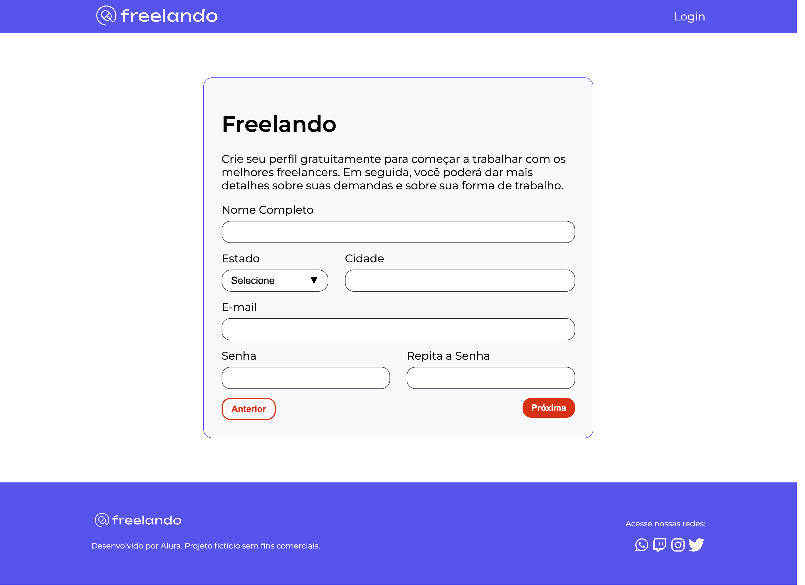

# Freelando

O Freelando é uma Startup. Nesse momento, ele possui uma tela inicial, de login e de cadastro.

## 🔨 Funcionalidades do projeto

Nesse primeiro momento, nós temos o fluxo que foi idealizada como a primeiro entrega do time de desenvolvimento. Agora, iremos refatorar os formulários existentes para aplicar a biblioteca Formik.

## ✔️ Técnicas e tecnologias utilizadas

Se liga nessa lista de tudo que usaremos nesse curso:

- `React`
- `Biblioteca Formik`
- `Componente Formik, Form, Formik e ErrorMessage`
- `Hook useFormikContext()`
- `Expressões regulares (Regex)`

E muito mais!

## 🛠️ Abrir e rodar o projeto

Para abrir e rodar o projeto, execute `npm i` para instalar as dependências e `npm run dev` para inicar o projeto.

Depois, acesse <a href="http://localhost:5173/">http://localhost:5173/</a> no seu navegador.
